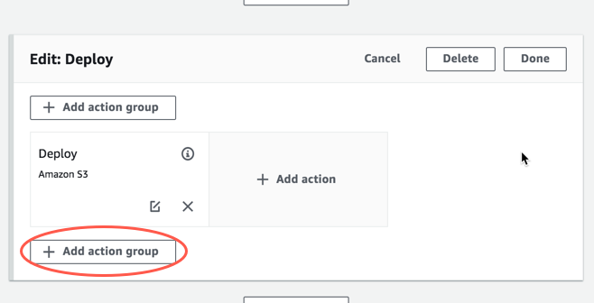
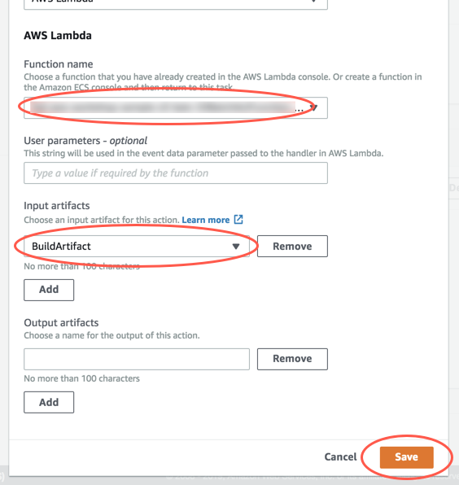
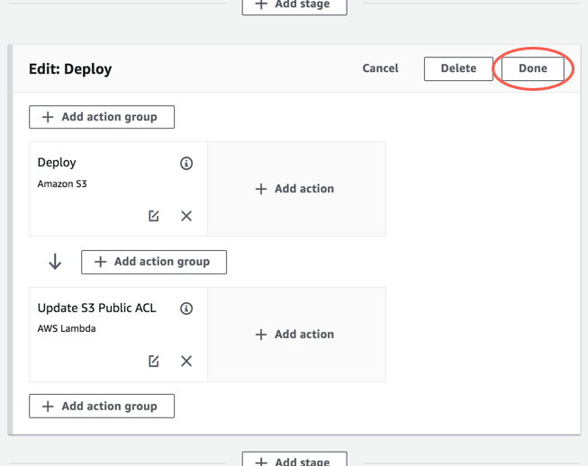

# lambda-codepipeline-s3-object-public-read

[AWS CodePipeline](https://aws.amazon.com/codepipeline/) is a fully managed continuous delivery (CD) service that lets you automate your software release process for fast and reliable updates. You can now use CodePipeline to deploy files, such as static website content or artifacts from your build process, to Amazon S3.

The S3 deployment action makes it very easy to update S3 Buckets used to host static websites, however the objects deployed do not have Public Read Access.  In cases where the S3 Bucket policy does no allow Public Read Access, this prevents users from accessing the website content.

When invoked by CodePipeline following a successful deployment to S3, the Lambda function builds a list of objects from the BuildArtifact and updates the ACLs for each to have Public Read Access.

```bash
.
├── README.md           <-- This instructions file
├── app                 <-- Source code for a lambda function
│   ├── index.js        <-- Lambda function code
│   └── package.json    <-- Node dependencies
└── template.yaml       <-- SAM template
```

## Requirements

* [AWS CLI](https://aws.amazon.com/cli/)
* [SAM CLI](https://docs.aws.amazon.com/serverless-application-model/latest/developerguide/serverless-sam-cli-install.html) (including Docker)

## Installing Lambda Function into AWS Account using Local Workstation

After the installation of the pre-requisites,

1. Clone this repository to your workstation.

2. Open a command line in the project directory.

3. Build the Lambda Function

    ```sam build```

4. Package the Lambda Function, substitute **S3_ARTIFACT_BUCKET** with the S3 Bucket to which you have access to store SAM artifacts.

    ```sam package --s3-bucket S3_ARTIFACT_BUCKET --output-template-file output-template.yaml```

5. Deploy the Lambda Function, substitute **YOUR_STACK_NAME** with the CloudFormation Stack name and **S3_DEPLOY_BUCKET** with the S3 Bucket to which you will deploy using the CodePipeline S3 Deploy action.

    ```sam deploy --template-file output-template.yaml --stack-name YOUR_STACK_NAME --parameter-overrides S3BucketParameter=S3_DEPLOY_BUCKET --capabilities CAPABILITY_IAM```


## Configuring CodePipeline to use the Lambda Function

1. Click the **Edit** button next to the pipeline name:

    

2. Scroll down to the Deploy stage and click the **Edit** button.

    

3. Click the **Add action group** button.

    

4. Type an **Action name** and select **AWS Lambda** from the **Action provider** list.

    

5. In the AWS Lambda section, select the name of this Function that you've uploaded to your AWS account for **Function name**, select the same **Input artifact** used to deploy to S3, and click **Save**.

    

6. Click the **Done** button in the Deploy stage.

    

7. Scroll up to the top of the pipeline configuration and click the **Save** button.

    

